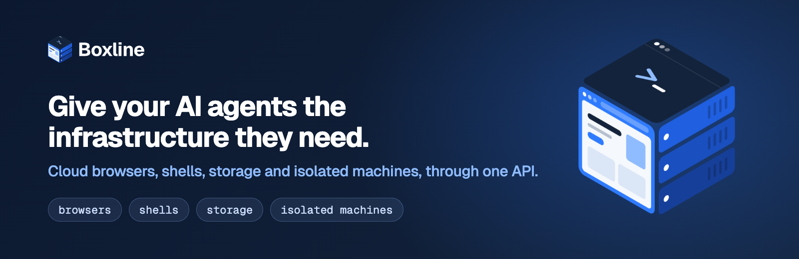
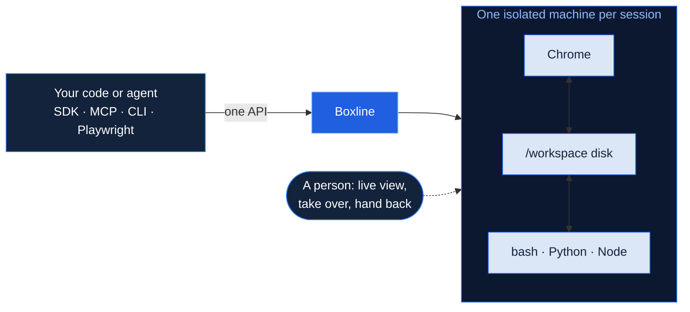

<p align="center">
  <a href="https://boxline.dev"></a>
</p>

<p align="center">
  <a href="https://www.npmjs.com/package/@boxline/sdk"></a>
  <a href="https://www.npmjs.com/package/@boxline/mcp"></a>
  <a href="https://pypi.org/project/boxline-sdk/"></a>
  <a href="https://www.npmjs.com/package/@boxline/cli"></a>
  <a href="https://docs.boxline.dev"></a>
  
</p>

An agent that does real work needs more than a model. It has to open websites, sign in, download files, run code
and check its own results, somewhere safe. **Boxline gives every agent its own cloud machine for that**, and you
drive it from your code, your agent framework or any MCP client.

| Browsers | Shells | Storage | Isolated machines |
|---|---|---|---|
| Real Chrome, driven by your agent, by Playwright or Puppeteer, or by computer-use models. Watch it live, take over, hand back. | bash with Python and Node in the same machine: install, download, run, test, convert. | A workspace disk the browser and the shell share, files in and out, saved logins that carry over. | Every session runs in its own sandboxed machine (gVisor). Pause, resume, or move it with its tabs and files. |

## How it works



## What agents do with it

- **Research and answer with sources**: search, read the pages, cite them ([research-a-question](https://github.com/Boxline-dev/examples/tree/main/research-a-question)).
- **Work behind a sign-in**: save a login once, reuse it, with two-factor codes ([two-factor-sign-in](https://github.com/Boxline-dev/examples/tree/main/two-factor-sign-in)).
- **Browser and shell together**: download a report, add it up in Python, type the total into a form ([download-and-add-up](https://github.com/Boxline-dev/examples/tree/main/download-and-add-up)).
- **Test a site**: clone a repository, run its tests against staging, open the failures in the browser ([test-my-staging-site](https://github.com/Boxline-dev/examples/tree/main/test-my-staging-site)).
- **Watch and report**: prices, changelogs and status pages on a schedule, with webhooks ([watch-a-price](https://github.com/Boxline-dev/examples/tree/main/watch-a-price)).
- **Turn the web into data**: crawl, extract to your JSON schema, build datasets for AI ([crawl-and-extract](https://github.com/Boxline-dev/examples/tree/main/crawl-and-extract)).

---

## Node.js and TypeScript

[`Boxline-dev/sdk-node`](https://github.com/Boxline-dev/sdk-node) · Node 18+

```bash
npm install @boxline/sdk
```

```ts
import { Boxline } from "@boxline/sdk";

const bx = new Boxline(); // reads BOXLINE_API_KEY

// Give the built-in agent a task in its own machine, and wait for the answer.
const run = await bx.agent.run({ task: "Find the price of the cheapest plan on https://example.com/pricing" });
console.log((await bx.agent.wait(run.id)).result);

// Or drive the machine yourself: a browser and a shell sharing one disk.
const session = await bx.sessions.create({ shell: true });
await session.goto("https://example.com");
const { content } = await session.content("markdown");
const { stdout } = await session.exec("python3 --version");
await session.release();
```

## Python

[`Boxline-dev/sdk-python`](https://github.com/Boxline-dev/sdk-python) · Python 3.9+, sync and async

```bash
pip install boxline-sdk
```

```python
from boxline import Boxline

bx = Boxline()  # reads BOXLINE_API_KEY

run = bx.agent.run("Find the price of the cheapest plan on https://example.com/pricing")
print(bx.agent.wait(run["id"])["result"])

with bx.sessions.create(shell=True) as session:  # released when the block ends
    print(session.exec("python3 --version")["stdout"])
```

## MCP server

[`Boxline-dev/mcp`](https://github.com/Boxline-dev/mcp) · for Claude, Cursor, VS Code and any MCP client

```json
{
  "mcpServers": {
    "boxline": {
      "command": "npx",
      "args": ["-y", "@boxline/mcp"],
      "env": { "BOXLINE_API_KEY": "bxl_your_key" }
    }
  }
}
```

22 tools: sessions, browser, mouse and keyboard, computer use, shell, Playwright, files, fetch and web search.

## Command line

[`Boxline-dev/cli`](https://github.com/Boxline-dev/cli) · Node 20+

```bash
npm install -g @boxline/cli
boxline login
boxline run "Open https://example.com and tell me what the page is about"
```

Also `boxline fetch`, `search`, `extract`, `crawl`, `screenshot`, `pdf`, `sessions`, `exec`, `shell` and `files`.

## Examples

[`Boxline-dev/examples`](https://github.com/Boxline-dev/examples) · 63 examples and 9 integrations, each in Node and Python with a result check that proves it worked, plus Claude Code skills. Integrations: Playwright, Puppeteer, Stagehand, Browser Use, LangChain, CrewAI, the Vercel AI SDK, and OpenAI and Claude computer use.

---

## Built for real work

- **A person when it matters**: the agent asks for help (a login, a code, a CAPTCHA), you take over in the live view and hand back.
- **Secrets the model never sees**: the agent uses `%NAME%`; the value is filled in on the machine, only on the sites you allow.
- **Saved logins**: sign in once, reuse it in later sessions, two-factor codes included.
- **Proxies and browser settings**: residential and datacenter proxies by country, ad blocking, cookie banners, Chrome extensions.
- **Quick APIs without a session**: fetch a page as Markdown, extract JSON to a schema, search the web, crawl a site, screenshot or PDF.
- **Tasks, schedules and webhooks**: save a task with variables and an output schema, run it on a cron, get the result by webhook.
- **See everything**: a recording of the screen, every step the agent took, network and console logs.
- **Models your way**: Anthropic and OpenAI included, or your own keys for them, Grok and Gemini.

<p align="center"><a href="https://boxline.dev">Website</a> · <a href="https://docs.boxline.dev">Docs</a> · <a href="https://app.boxline.dev">Console</a></p>
